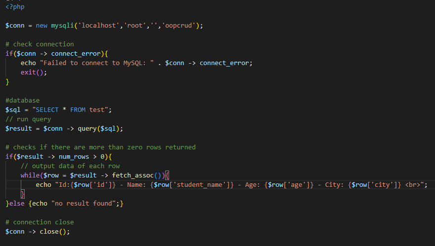

# mysqli object oriented style

### -> [ Create Connection ](https://www.w3schools.com/php/func_mysqli_connect.asp)
- server_name, username, password, database_name
- check if database successfully established or not!
- run sql query
- checks if there are more than zero rows returned
- output data of each row
- close connection

## Preview:

